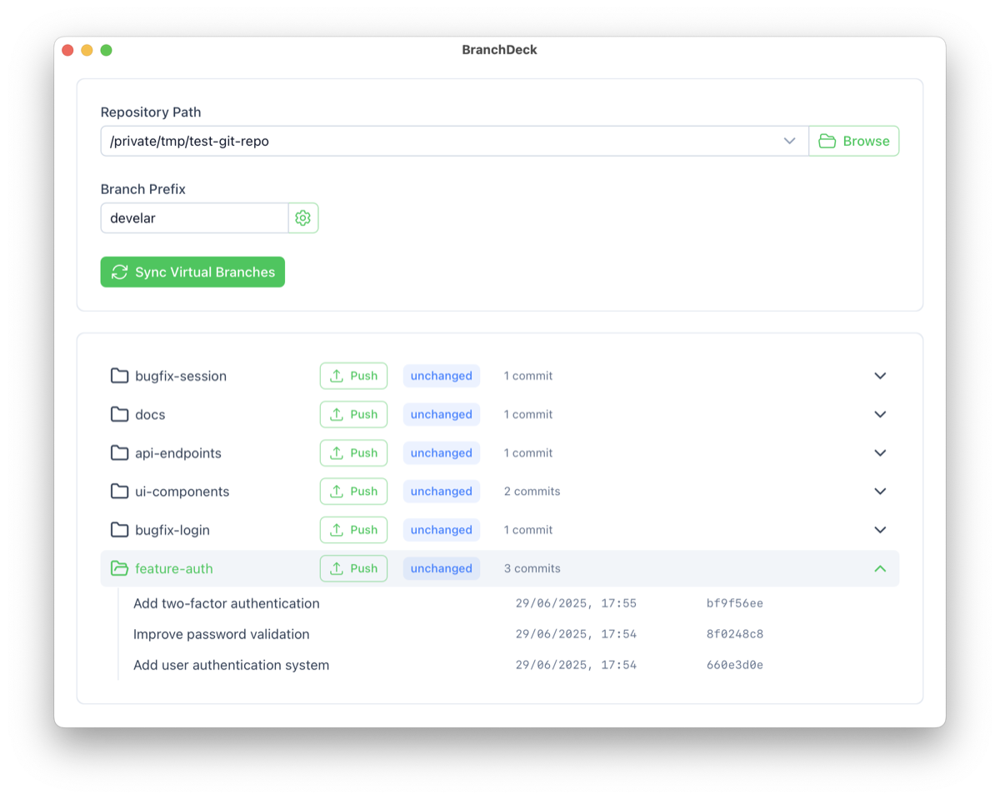

# Branch Deck

**💡 First, consider [GitButler](https://gitbutler.com)**

Branch Deck is a lightweight workaround for [performance issues](https://github.com/gitbutlerapp/gitbutler/issues/3235) in GitButler when working with large repositories.

It automatically creates Git branches from commits with prefixed messages—helping you organize your work without the hassle of manual branch management.

---

## ✨ What It Does

Branch Deck scans your commit history and automatically generates Git branches based on commit message prefixes. All commits sharing the same prefix are cherry-picked into a dedicated branch.

---

## ⚙️ How It Works

Commit messages using the `[prefix]` format are used to create and populate new branches. For example:

* `[feature-auth]` → branch `feature-auth`
* `[bugfix-login]` → branch `bugfix-login`
* Commits without a prefix remain on the main branch

This makes it easy to maintain a clean, segmented Git history while developing multiple features or fixes in parallel.

---

## 🚧 Limitations

* **No sub-branching yet**: Nested structures like `[feature-auth/oauth]` are not supported (yet).

---

- Sub-branches not yet supported: Nested branch structures (e.g., `[feature-auth/oauth]`) are not currently implemented.

* **Simple**: Just prefix your commits with `[name]`
* **Automatic**: Branches are created for you—no manual steps required
* **Organized**: Your history is cleaner, and features are neatly separated
* **Flexible**: Work on multiple tasks in one working directory without clutter

---

## 🛠 Installation

👉 [Download the latest release](https://github.com/develar/branch-deck/releases/latest)

> ⚠️ Auto-update is not supported at the moment but is on the roadmap.

---

## 🤝 Contributing

Interested in contributing? Check out [DEVELOPMENT.md](DEVELOPMENT.md) for setup instructions and guidelines.
