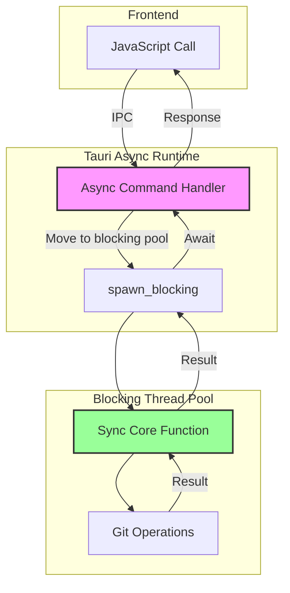
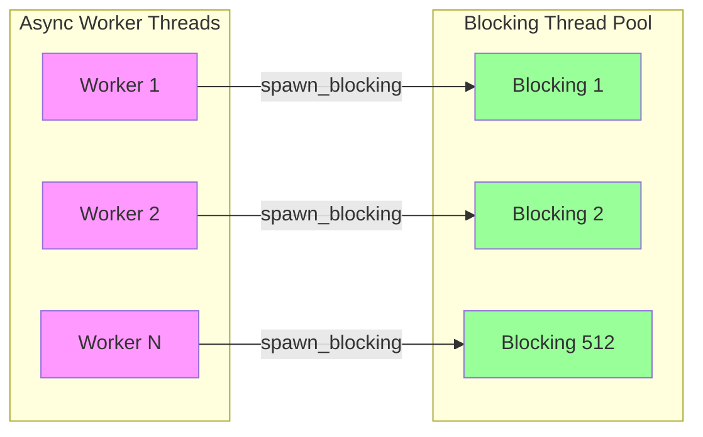

# Async Patterns and spawn_blocking

**Status:** Implemented  
**Updated:** 2025-08-23  
**Tags:** [async, performance, tauri]

## Problem

Tauri commands must be async to avoid blocking the UI thread, but git operations are inherently blocking I/O using synchronous system calls. Running blocking operations directly in async functions blocks the async worker threads, starving the runtime and degrading performance.

The challenge: How to bridge async Tauri commands with synchronous git operations without blocking async threads or adding unnecessary complexity?

## Solution Overview

Use `spawn_blocking` to move all blocking I/O to dedicated thread pools. Tauri commands become thin async wrappers that immediately delegate to synchronous core functions running on blocking threads. This maintains clean separation between async coordination and blocking execution.

## Design

### Architecture

### Thread Pool Architecture

### Key Decisions

1. **Decision**: Synchronous GitCommandExecutor
   **Rationale**: Git operations are blocking; no benefit from async complexity

2. **Decision**: spawn_blocking in every Tauri command
   **Rationale**: Consistent pattern, prevents async thread blocking

3. **Decision**: Separate core functions from command handlers
   **Rationale**: Core logic is testable without async runtime

4. **Decision**: Clone state for 'static lifetime
   **Rationale**: spawn_blocking requires 'static, State is not 'static

5. **Decision**: JoinSet.spawn_blocking for parallel operations
   **Rationale**: Direct spawning without double-async wrapper

### Implementation Notes

Pattern structure:
- **Tauri Command**: Async wrapper with `#[tauri::command]` (see `src-tauri/src/commands/`)
- **Core Function**: Synchronous implementation with actual logic
- **State Cloning**: Clone `State<T>` before moving to blocking thread
- **Error Mapping**: Convert JoinError to user-friendly message

Parallel operations:
- Use `JoinSet::spawn_blocking` directly
- Avoid `spawn(async { spawn_blocking(...) })` double-spawning
- Semaphore for concurrency limiting when needed

## Alternatives Considered

- **Async Process Spawning (tokio::process::Command)**:
  - Why not: While tokio::process::Command provides async process spawning, git operations themselves are still blocking I/O. Using async process adds complexity without performance benefit over std::process::Command with spawn_blocking

- **Blocking in Async Functions**:
  - Why not: Blocks async worker threads, ruins performance

- **Separate Thread Pool Management**:
  - Why not: Tokio's blocking pool is well-tuned and sufficient

- **Actor Model with Channels**:
  - Why not: Adds complexity without performance benefit

## Performance Considerations

- **Constraint**: Limited async worker threads (typically CPU cores * 2)
- **Solution**: Never block async threads, use blocking pool (max 512 threads)
- **Measurement**: Git operations move off async threads in <1μs

Thread pool characteristics:
- Async workers: Must never block, handle coordination only
- Blocking pool: Grows on demand up to 512 threads
- spawn_blocking overhead: ~1-5μs per call
- Parallel speedup: Near-linear for independent git operations

## References

- Implementation: `src-tauri/src/commands/` - All Tauri commands
- Core functions: Synchronous functions called from commands
- GitCommandExecutor: `crates/git-executor/src/git_command_executor.rs`
- Tests: Much simpler without async - see any `#[test]` vs `#[tokio::test]`
- Related: [Tokio spawn_blocking docs](https://docs.rs/tokio/latest/tokio/task/fn.spawn_blocking.html)