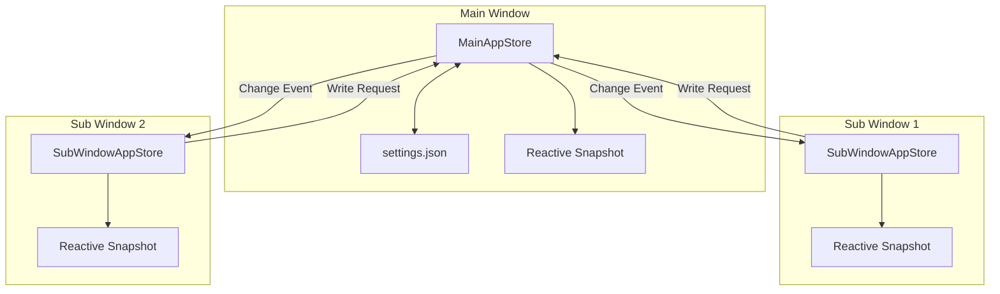
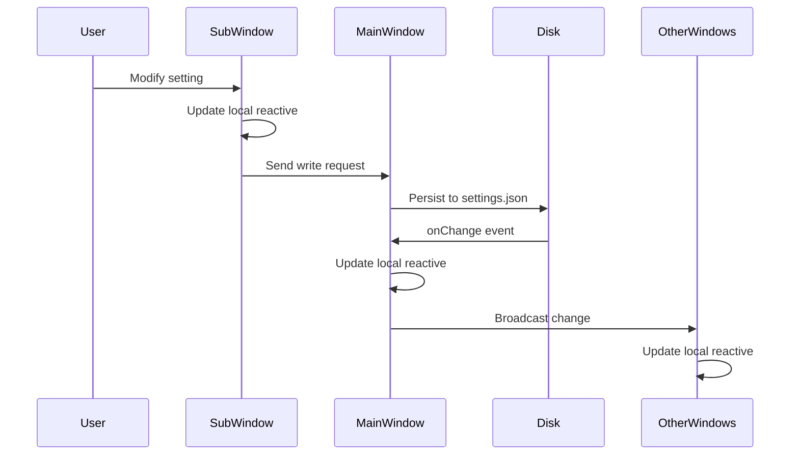

# Distributed Settings Architecture

**Status:** Implemented  
**Updated:** 2025-08-23  
**Tags:** [settings, reactivity, tauri]

## Problem

Multi-window desktop applications need synchronized settings across all windows while maintaining Vue's reactivity. Each window needs immediate access to settings without async loading delays, and changes in one window must instantly reflect in others.

The challenge: How to maintain a single source of truth for settings while keeping reactive objects working correctly in each window's Vue instance?

## Solution Overview

The main window owns the settings file and acts as the authoritative source. Sub-windows proxy their writes through the main window and receive change broadcasts. Settings are preloaded during window creation for instant access, and reactive objects are updated in-place to preserve Vue reactivity.

## Design

### Architecture

### Data Flow

### Key Decisions

1. **Decision**: Main window as single source of truth
   **Rationale**: Avoids distributed state conflicts, simpler than consensus protocols

2. **Decision**: In-place reactive object updates
   **Rationale**: Preserves Vue reactivity, maintains component references

3. **Decision**: Preload settings during window creation
   **Rationale**: Instant access without async loading, better UX

4. **Decision**: Reactive objects live in snapshot, not separately
   **Rationale**: Single storage location, no duplication, cleaner architecture

5. **Decision**: Lazy reactive object creation
   **Rationale**: Only create reactive wrappers when accessed, saves memory

### Implementation Notes

Core components:
- **AppStore**: Main window storage layer (see `app/utils/appStore.ts`)
- **SubWindowAppStore**: Proxy for sub-windows
- **createPersistentStore**: Creates reactive stores with Zod validation
- **Settings injection**: Via `window.__TAURI_STORE__` during window creation

Reactive lifecycle:
1. Raw data loaded from disk
2. First access converts to reactive object
3. Changes watched and persisted (debounced 500ms)
4. Updates propagated via Tauri events

## Alternatives Considered

- **Each Window Manages Own File**:
  - Why not: File conflicts, race conditions, complex merging

- **Shared Memory/IPC State**:
  - Why not: Platform-specific, complex lifecycle management

- **Database with Transactions**:
  - Why not: Overkill for settings, deployment complexity

- **CRDT for Conflict-Free Updates**:
  - Why not: Unnecessary complexity for settings use case

## Performance Considerations

- **Constraint**: Settings must be immediately available on window open
- **Solution**: Preload and inject before Vue app initialization
- **Measurement**: Zero-delay access to settings, <10ms update propagation

Optimizations:
- Synchronous snapshot access (no await needed)
- Debounced persistence (500ms) reduces disk writes
- Minimal data transmission (only raw values, not reactive objects)
- In-place updates avoid object recreation

## References

- Implementation: `app/utils/appStore.ts`, `app/plugins/tauri-store.client.ts`
- Store creation: `app/composables/createPersistentStore.ts`
- Tests: `tests/unit/appStore.test.ts`
- Related: [virtual-branches.md](virtual-branches.md)