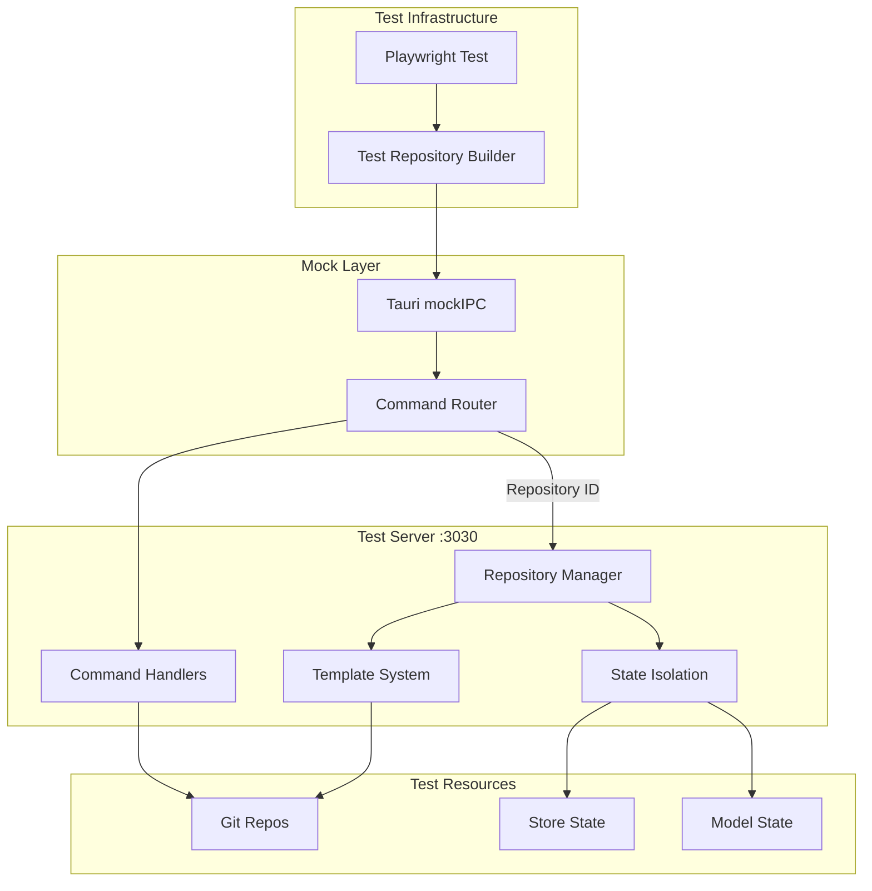
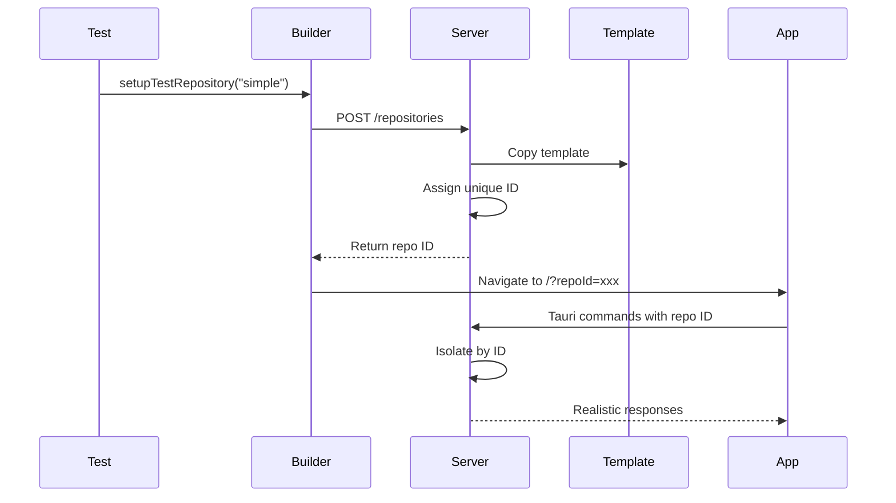

# E2E Testing Architecture

**Status:** Implemented  
**Updated:** 2025-08-23  
**Tags:** [testing, playwright, mocking]

## Problem

Testing a desktop Git application requires isolated environments for each test to avoid interference. Tests need predictable repository states, realistic Tauri command behavior, and the ability to simulate various error conditions.

The challenge: How to provide complete test isolation while accurately simulating production behavior, including Git operations, Tauri IPC, and error handling?

## Solution Overview

A custom test server (port 3030) provides isolated Git repositories from templates for each test. Tauri commands are mocked to route through this server, which maintains separate state per test via repository IDs. Templates are pre-created for fast test startup, and the mock layer accurately simulates Tauri's Result type system.

## Design

### Architecture

### Test Isolation Flow

### Key Decisions

1. **Decision**: Test server instead of real Tauri backend
   **Rationale**: Complete control over responses, faster than full app startup

2. **Decision**: Template system for repositories
   **Rationale**: Fast test startup, consistent initial state, no git init overhead

3. **Decision**: Repository ID routing via URL parameter
   **Rationale**: Simple isolation mechanism, survives navigation

4. **Decision**: Mock Tauri Result type accurately
   **Rationale**: Tests must handle errors exactly as in production

5. **Decision**: Pre-create templates at server startup
   **Rationale**: Eliminates per-test repository creation overhead

### Implementation Notes

Template system:
- **Templates**: `simple`, `unassigned`, `conflict_*`, `NO_REPO`, `empty-non-git`
- **Location**: Created in `tests/test-repos/` at server startup
- **Usage**: Copied to unique directory per test

Mock implementation:
- **IPC Interception**: `mockIPC` redirects all Tauri commands
- **Error Simulation**: Throws JavaScript Error to match Tauri behavior
- **Result Wrapping**: Bindings layer wraps in `{status: "error", error: "..."}`

State isolation:
- **Repository mapping**: `path_to_id` map for command routing
- **Store state**: Separate per repository ID
- **Configuration**: `__BRANCH_DECK_TEST_CONFIG__` for test-specific behavior

## Alternatives Considered

- **Real Tauri Backend**:
  - Why not: Slow startup, harder to control state, complex cleanup

- **In-Memory Git**:
  - Why not: libgit2 differences, not representative of real git CLI

- **Shared Test Repositories**:
  - Why not: Test interference, race conditions, unpredictable state

- **Docker Containers**:
  - Why not: Overhead, complexity, platform differences

## Performance Considerations

- **Constraint**: Tests must run in parallel without interference
- **Solution**: Complete isolation via repository IDs
- **Measurement**: Test startup < 100ms, full suite < 30s

Optimizations:
- Template pre-creation eliminates git init per test
- Parallel test execution with independent state
- Element-based waiting instead of fixed timeouts
- Direct file operations for template copying

## References

- Implementation: `tests/test-server/`, `tests/e2e/`
- Test helpers: `tests/e2e/helpers/`
- Mock layer: `app/plugins/tauri-mock.client.ts`
- Templates: `tests/test-server/templates/`
- Related: [virtual-branches.md](virtual-branches.md)