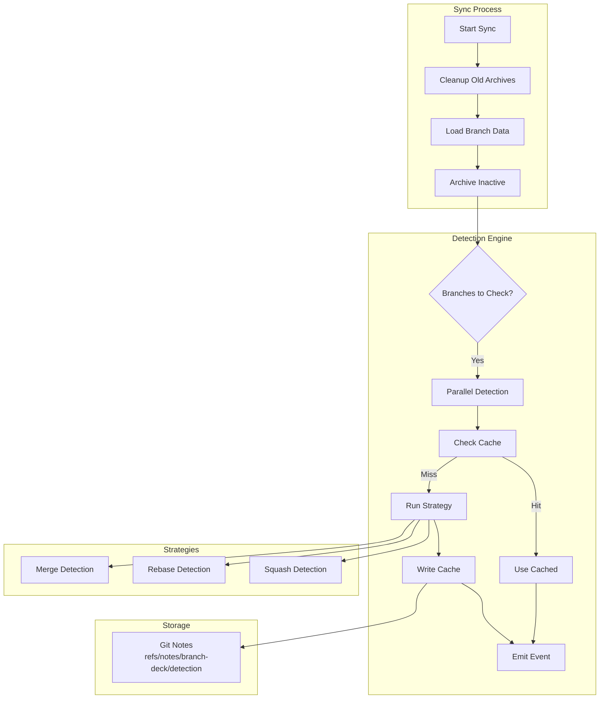

# Integration Detection and Caching

**Status:** Implemented  
**Updated:** 2025-08-22  
**Tags:** [git, performance, caching]

## Problem

Developers need to know which branches have been integrated into the baseline (merged, rebased, or squashed) to clean up completed work. Without detection, branches accumulate indefinitely, making it hard to distinguish active work from completed features.

Detecting integration is expensive - it requires analyzing commit history for every branch. Without caching, this becomes a performance bottleneck as repositories grow.

## Solution Overview

By default, detect branch integration using only the rebase/cherry-pick strategy for optimal performance. This fast detection covers most common workflows where commits are cherry-picked or rebased onto the baseline. Full detection including merge and squash strategies is available via environment variable when needed.

Results are cached as git notes on branch tip commits, providing instant lookups for unchanged branches while automatically invalidating when branches receive new commits. The system runs detection in parallel for performance, writes cache entries sequentially to avoid races, and uses compact JSON encoding to minimize storage overhead.

## Design

### Architecture

### Key Decisions

1. **Decision**: Use git notes for caching
   **Rationale**: Travels with repo, survives rebases, automatic invalidation when tip changes

2. **Decision**: Parallel detection with sequential cache writes
   **Rationale**: Maximizes performance while avoiding git notes write races

3. **Decision**: Compact JSON with abbreviated field names
   **Rationale**: 15-85% smaller cache entries, significant with thousands of branches

4. **Decision**: Default to Rebase strategy only
   **Rationale**: Fast cherry-pick detection covers most workflows; Full detection optional via env var

5. **Decision**: Cache all statuses, not just integrated
   **Rationale**: Avoid re-computation for any unchanged branch

### Implementation Notes

- **Detection Strategies**: 
  - Merge: Uses `git branch --merged` (see `crates/branch-integration/merge.rs`)
  - Rebase: Cherry-pick markers via `--cherry-mark` (see `rebase.rs`)
  - Squash: Diff comparison and tree matching (see `squash.rs`)

- **Cache Management**:
  - Stored at branch tip SHA, auto-invalidates on new commits
  - Versioned format for future migration
  - Compact encoding with field omission for defaults

- **Performance Optimizations**:
  - Batch fetch all branch data in single git call
  - JoinSet for parallel processing
  - Stream results as events for UI responsiveness

## Alternatives Considered

- **External Database for Cache**:
  - Why not: Doesn't travel with repo, adds infrastructure complexity

- **File-based Cache in .git**:
  - Why not: Doesn't survive clones, manual invalidation needed

- **Commit Messages for Tracking**:
  - Why not: Requires modifying history, incompatible with existing repos

- **Always Detect Without Caching**:
  - Why not: O(n*m) complexity becomes prohibitive at scale

## Performance Considerations

- **Constraint**: Must handle 10,000+ archived branches
- **Solution**: Parallel detection, git notes for O(1) lookups
- **Measurement**: Detection + caching for 1000 branches < 5 seconds

Key optimizations:
- Single `git log --no-walk` fetches all notes
- Parallel detection with configurable concurrency
- "Detect once, cache forever" for integrated branches
- Compact cache format reduces I/O

## References

- Implementation: `crates/branch-integration/`
- Cache format: `crates/branch-integration/cache.rs`
- Detection strategies: `merge.rs`, `rebase.rs`, `squash.rs`
- Tests: `crates/integration-detection-tests/`
- Related: [virtual-branches.md](virtual-branches.md)