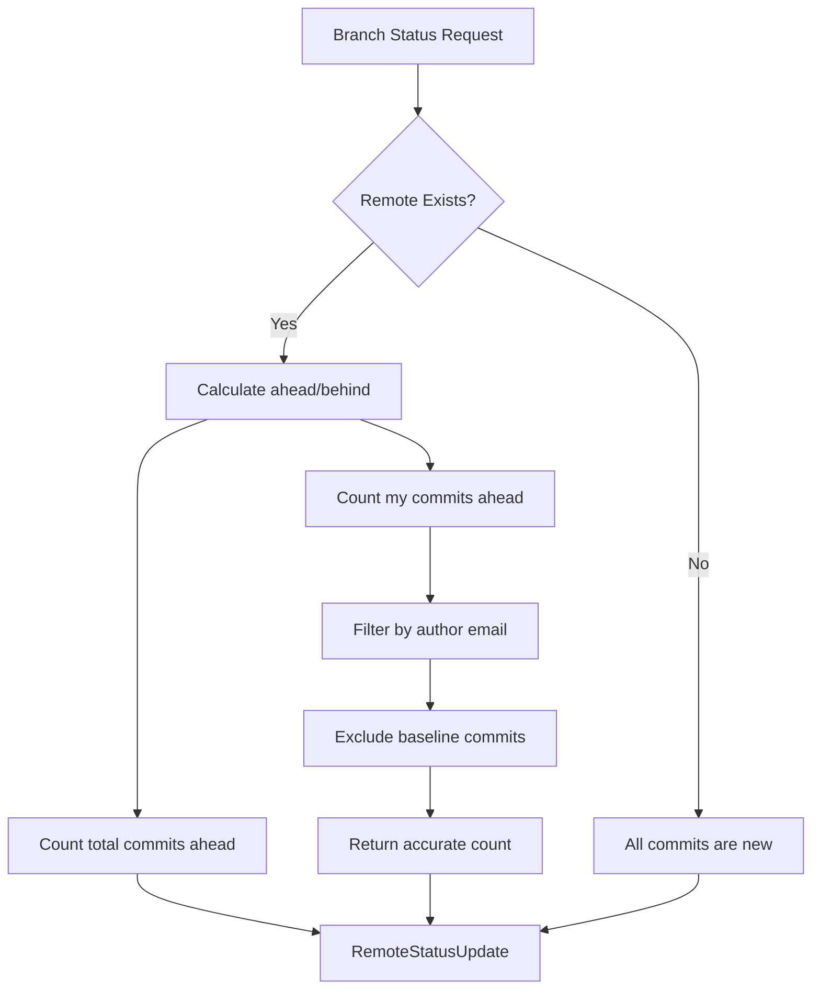

# Remote Status for Virtual Branches

**Status:** Implemented  
**Updated:** 2025-09-09  
**Tags:** [git, remote-status, virtual-branches]

## Problem

Virtual branches are continuously rebased onto the latest baseline (main), accumulating both feature commits and baseline commits. When displaying remote status, we need to accurately show:
- How many commits are ahead/behind the remote
- Which commits are actually the user's new work versus baseline commits
- Clear indication of what will be pushed to remote

The challenge is providing accurate "my commits" counts that reflect only the user's actual feature work, excluding both baseline commits and commits already integrated through other branches.

Additionally, when virtual branches are rebased onto the latest baseline, they create a diverged history where:
- Local branch has commits with new SHAs (after rebase)  
- Remote branch has commits with old SHAs (before rebase)
- The commit content is identical, but naive SHA comparison shows misleading "commits behind"
- Users see confusing messages like "1 commit you removed or changed locally" when they haven't changed anything

## Solution Overview

Calculate remote status using Git's cherry-pick algorithm for patch-equivalent comparison:
- **Total commits ahead** shows all commits that will be pushed
- **Commits behind** uses `--cherry-pick` to exclude patch-equivalent commits, preventing false divergence
- **"My commits"** filters by author email using cherry-pick for accurate attribution
- **UI display** always shows user's commit count explicitly ("0 (n)↑" format) with clear messaging

This approach ensures users see accurate status without confusion from rebased commits that appear different but contain identical content.

## Design

### Architecture

### Key Decisions

1. **Decision**: Filter "my commits" by author email
   **Rationale**: Virtual branches may contain commits from multiple authors; users need to see their own contributions

2. **Decision**: Use `^baseline` exclusion in addition to author filter
   **Rationale**: Author's commits may already be integrated through other branches; exclude duplicates

3. **Decision**: Separate counts for total vs "my" commits
   **Rationale**: Users need both perspectives - total shows everything that will be pushed, "my" shows personal contributions

4. **Decision**: Pass baseline branch through sync pipeline
   **Rationale**: Consistent access to baseline reference for filtering operations

5. **Decision**: Use `--cherry-pick` for commits behind calculation
   **Rationale**: After rebasing, commits have different SHAs but same content. Using `--cherry-pick` correctly identifies patch-equivalent commits, preventing false "commits behind" counts that confuse users with messages about "commits you removed or changed locally"

### Implementation Details

The remote status calculation uses git's cherry-pick algorithm for patch-equivalent comparison:
- **Total commits ahead**: `git rev-list --left-right --count origin/branch...local` (right side)
- **Commits behind (patch-aware)**: `git rev-list --cherry-pick --left-only --count origin/branch...local`
- **My commits ahead**: `git rev-list --cherry-pick --right-only --author {email} origin/branch...local`

The cherry-pick algorithm ensures accurate comparison:
1. `--cherry-pick` - Excludes commits that are patch-equivalent (same content, different SHA)
2. `--left-only` / `--right-only` - Shows commits unique to remote/local respectively
3. `--author {email}` - Filters by commit author for personal attribution

Key components:
- **Remote status calculation**: `crates/sync-core/src/remote_status.rs`
- **UI display**: `app/composables/remoteStatusText.ts` 
- **Branch processor**: Uses `BranchProcessingParams` to carry baseline reference
- **Sync orchestration**: Propagates baseline through entire pipeline

## UI Display Considerations

### Commit Count Display
- Always show user's commit count explicitly: "0 (n)↑" format instead of just "n↑"
- Use consistent terminology: "no local authored changes" instead of confusing phrases
- Avoid misleading messages about "commits you removed" when they're just rebased

### Handling Rebased Branches
When branches are rebased onto latest master, the remote still has old pre-rebase commits. The `--cherry-pick` algorithm correctly identifies these as patch-equivalent, showing 0 commits behind instead of confusing users with diverged history counts.

## Alternatives Considered

- **Show Only Feature Commits (Hide Baseline)**:
  - Why not: Users need to see total push size for bandwidth/review considerations

- **Complex Commit Tracking with Metadata**:
  - Why not: Git's built-in exclusion syntax is simpler and more performant

- **Calculate Merge Base for Each Commit**:
  - Why not: Expensive operation, especially for branches with many commits

- **Use Git Notes for Commit Attribution**:
  - Why not: Adds complexity when simple exclusion syntax suffices

## Performance Considerations

- **Constraint**: Must not slow down status calculation
- **Solution**: Single additional exclusion in existing git command
- **Measurement**: Negligible performance impact (<1ms added)

The `^baseline` syntax is highly optimized in git's revision walking algorithm, adding minimal overhead.

## References

- Implementation: `crates/sync-core/src/remote_status.rs`
- Tests: `crates/integration-detection-tests/src/remote_status_tests.rs`
- Related: [virtual-branches.md](virtual-branches.md) - Virtual branch architecture