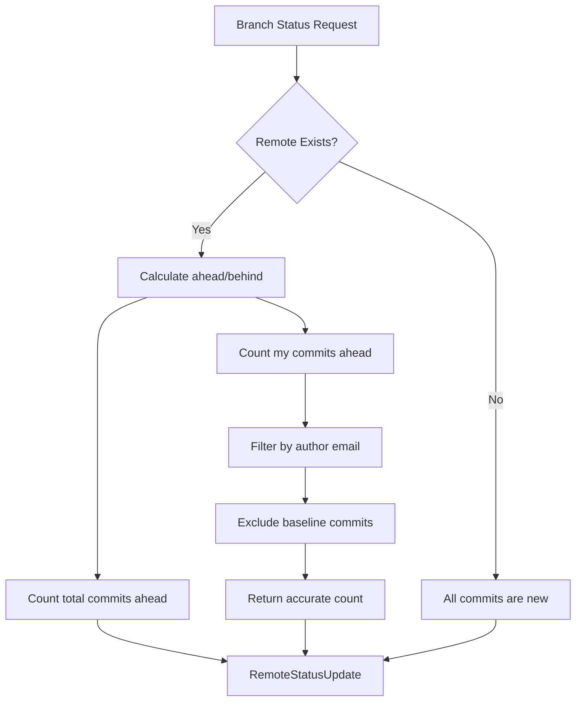

# Remote Status for Virtual Branches

**Status:** Implemented  
**Updated:** 2025-08-23  
**Tags:** [git, remote-status, virtual-branches]

## Problem

Virtual branches are continuously rebased onto the latest baseline (main), accumulating both feature commits and baseline commits. When displaying remote status, we need to accurately show:
- How many commits are ahead/behind the remote
- Which commits are actually the user's new work versus baseline commits
- Clear indication of what will be pushed to remote

The challenge is providing accurate "my commits" counts that reflect only the user's actual feature work, excluding both baseline commits and commits already integrated through other branches.

## Solution Overview

Calculate remote status using Git's filtering capabilities:
- Total commits ahead shows all commits that will be pushed
- "My commits" filters by author email AND excludes baseline commits
- Combines `--author` filter with `^baseline` exclusion for precise attribution

This dual filtering ensures users see only their own feature work, excluding both other authors' commits and baseline commits that were already integrated.

## Design

### Architecture

### Key Decisions

1. **Decision**: Filter "my commits" by author email
   **Rationale**: Virtual branches may contain commits from multiple authors; users need to see their own contributions

2. **Decision**: Use `^baseline` exclusion in addition to author filter
   **Rationale**: Author's commits may already be integrated through other branches; exclude duplicates

3. **Decision**: Separate counts for total vs "my" commits
   **Rationale**: Users need both perspectives - total shows everything that will be pushed, "my" shows personal contributions

4. **Decision**: Pass baseline branch through sync pipeline
   **Rationale**: Consistent access to baseline reference for filtering operations

### Implementation Details

The remote status calculation uses two different git commands:
- **Total commits ahead**: `git rev-list --count origin/branch..local`
- **My commits (authored by me)**: `git rev-list --count -F --author {email} origin/branch..local ^baseline`

The "my commits" command combines two filters:
1. `--author {email}` - Only counts commits authored by the current user
2. `^baseline` - Excludes any commits already in the baseline branch

Key components:
- **Remote status calculation**: `crates/sync-core/src/remote_status.rs`
- **Branch processor**: Uses `BranchProcessingParams` to carry baseline reference
- **Sync orchestration**: Propagates baseline through entire pipeline

## Alternatives Considered

- **Show Only Feature Commits (Hide Baseline)**:
  - Why not: Users need to see total push size for bandwidth/review considerations

- **Complex Commit Tracking with Metadata**:
  - Why not: Git's built-in exclusion syntax is simpler and more performant

- **Calculate Merge Base for Each Commit**:
  - Why not: Expensive operation, especially for branches with many commits

- **Use Git Notes for Commit Attribution**:
  - Why not: Adds complexity when simple exclusion syntax suffices

## Performance Considerations

- **Constraint**: Must not slow down status calculation
- **Solution**: Single additional exclusion in existing git command
- **Measurement**: Negligible performance impact (<1ms added)

The `^baseline` syntax is highly optimized in git's revision walking algorithm, adding minimal overhead.

## References

- Implementation: `crates/sync-core/src/remote_status.rs`
- Tests: `crates/integration-detection-tests/src/remote_status_tests.rs`
- Related: [virtual-branches.md](virtual-branches.md) - Virtual branch architecture