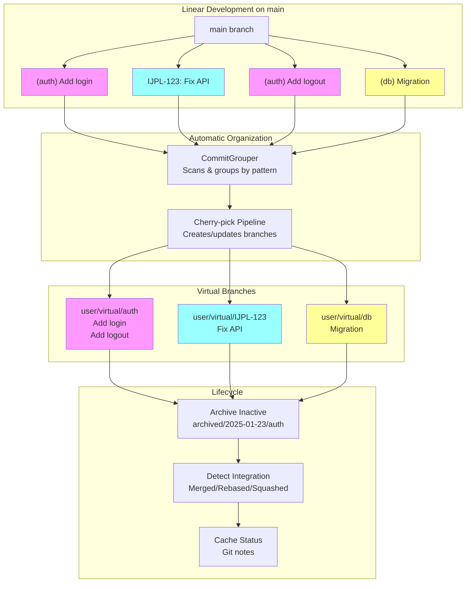

# Virtual Branches Architecture

**Status:** Implemented  
**Updated:** 2025-08-23  
**Tags:** [architecture, git, workflow]

## Problem

Modern development workflows suffer from branch management chaos:
- Developers work on multiple features simultaneously but struggle to organize commits
- Traditional branches require constant switching and rebasing
- Commit history becomes tangled with interleaved changes
- No automatic way to group related commits into logical units

Branch Deck solves this by enabling linear development on main while automatically organizing commits into virtual branches based on commit message patterns.

## Solution Overview

Branch Deck watches your commits for grouping patterns (like `(feature-auth)` prefixes or `IJPL-123` issue keys) and automatically cherry-picks related commits into dedicated virtual branches. This allows developers to work linearly on main while maintaining clean, organized virtual branches for review and integration.

The system handles the entire lifecycle: creating virtual branches, archiving inactive ones, detecting when branches are integrated back into main, and cleaning up completed work.

## Design

### Architecture

### Key Decisions

1. **Decision**: Use commit message patterns for grouping
   **Rationale**: Zero friction - developers just commit normally with a prefix, no tool commands needed
   
2. **Decision**: Cherry-pick commits to virtual branches instead of rebasing
   **Rationale**: Preserves original commits on main, allows clean history on virtual branches

3. **Decision**: Archive by date (`archived/YYYY-MM-DD/branch-name`)
   **Rationale**: Natural organization, easy cleanup of old branches, clear timeline

### Implementation Notes

- **Commit Grouping**: `CommitGrouper` scans commits and extracts patterns (see `crates/sync-core/src/commit_grouper.rs`)
- **Branch Materialization**: Cherry-picks grouped commits onto baseline (see `crates/git-ops/src/cherry_pick.rs`)
- **Integration Detection**: Parallel strategies for merge/rebase/squash detection (see `crates/branch-integration/`)
- **Async Boundaries**: Tauri commands use `spawn_blocking` for git operations (see `src-tauri/src/commands/`)

## Alternatives Considered

- **GitButler (Recommended for Most Users)**:
  - GitButler provides a more comprehensive solution for branch management with virtual branches
  - Branch Deck exists specifically as a workaround for GitButler's [performance](https://github.com/gitbutlerapp/gitbutler/issues/3235) [issues](https://github.com/gitbutlerapp/gitbutler/issues/9018) on large repositories
  - Why Branch Deck instead: Only when working with very large codebases where GitButler performance degrades
  - Consider GitButler first unless you have a large repository with performance constraints

## Performance Considerations

- **Constraint**: Must handle repositories with 10,000+ branches
- **Solution**: Batch operations, parallel detection, git notes caching
- **Measurement**: Sync completes in <2s for typical 100-branch repository

Key optimizations:
- Native Git CLI via direct command execution - no libgit2 or reimplementation overhead
- Modern Git features optimized for large repositories (cherry-mark, merge-tree, batch operations)
- Parallel processing of independent operations across multiple CPU cores
- Efficient caching with git notes to avoid redundant computations
- Result: Can sync hundreds of commits into virtual branches in seconds, even on large monorepos

## References

- Implementation: `crates/sync-core/`, `src-tauri/src/commands/`
- Tests: `crates/integration-detection-tests/`
- Related docs: 
  - [integration-detection.md](integration-detection.md) - Detection strategies
  - [distributed-settings.md](distributed-settings.md) - Settings synchronization
  - [async-patterns.md](async-patterns.md) - Async/sync boundaries