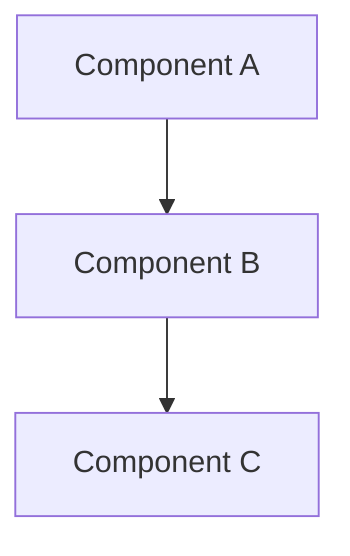

# Technical Design Documentation Guidelines

**Status:** Active  
**Updated:** 2025-08-23  

## Purpose

All technical design documents follow a hybrid RFC-Light + TDD (Technical Design Document) format that:
- **Explains the why**: Clear problem statement and rationale for decisions
- **Documents the how**: Architecture diagrams and implementation approach  
- **Is AI-friendly**: Consistent structure for easy parsing and understanding
- **Is human-friendly**: Visual diagrams over code, concise explanations
- **References code**: Points to implementations rather than duplicating

## When to Write a Design Doc

Create a design document when:
- Implementing a complex feature or system
- Making architectural decisions with long-term impact
- The "why" behind choices needs to be preserved
- Performance considerations are critical
- Multiple alternatives were evaluated

## Document Format

```markdown
# Feature/System Name

**Status:** Draft | Implemented | Deprecated  
**Updated:** YYYY-MM-DD  
**Tags:** [relevant, topics, here]

## Problem

What problem does this solve? Why does it matter?
(2-3 paragraphs maximum)

## Solution Overview

High-level approach in 2-3 paragraphs. What's the core idea?

## Design

### Architecture



Explain the architecture shown in the diagram.

### Key Decisions

1. **Decision**: What you decided
   **Rationale**: Why you made this choice
   
2. **Decision**: Another important choice
   **Rationale**: The reasoning behind it

### Implementation Notes

- Component A: what it does (see `path/to/file.rs`)
- Component B: its responsibility (see `src/module.ts`)
- Key algorithms or approaches (reference the code)

## Alternatives Considered

- **Option A**: Brief description
  - Why not: The reason we didn't choose it
  
- **Option B**: Brief description
  - Why not: Trade-offs that ruled it out

## Performance Considerations

(Include only when performance is a key concern)

- **Constraint**: What performance requirement exists
- **Solution**: How we meet it
- **Measurement**: How we verify it

## References

- Implementation: `path/to/main/implementation`
- Tests: `tests/feature/`
- Related docs: [other-design.md]
```

## Writing Guidelines

### Structure
- **Problem before solution**: Always explain what problem you're solving first
- **Decisions with rationale**: Document not just what, but why
- **Diagrams over text**: A good diagram replaces paragraphs of explanation
- **Code references, not code**: Point to implementations, don't duplicate them

### Style
- **Concise**: Each section should be as brief as possible while remaining clear
- **Focused**: One document per system or major feature
- **Practical**: Focus on what developers need to understand

### Diagrams
- Use [Mermaid](https://mermaid.js.org/) for all diagrams
- Common types:
  - `flowchart` for architecture and data flow
  - `sequenceDiagram` for interactions over time
  - `stateDiagram` for state machines
- Keep diagrams simple and focused on key relationships

### Code References
Instead of including code blocks:
- ✅ "See `crates/sync-core/src/remote_status.rs:45-53` for the implementation"
- ✅ "The `GitCommandExecutor` handles all git operations"
- ✅ "Algorithm details in `compute_integration_status()`"
- ❌ Long code snippets
- ❌ Implementation details that belong in code comments

### Status Values
- **Draft**: Design under discussion
- **Implemented**: Design is built and in use
- **Deprecated**: No longer current, kept for historical reference

### Performance Section
Include only when performance is a design driver:
- State specific constraints (e.g., "must handle 10k branches")
- Explain how the design meets these constraints
- Reference benchmarks or measurements if available

## Location

All design docs go in `docs/design/` with descriptive names:
- `distributed-settings.md` ✅
- `async-patterns.md` ✅
- `remote-status-bug-fix.md` ❌ (too specific, should be in git history)

## Examples of Good Design Docs

A good design doc:
- Starts with a clear problem statement
- Uses diagrams to show architecture
- Documents key decisions with rationale
- References code without duplicating it
- Remains stable as implementation evolves

## Anti-patterns to Avoid

- ❌ Code dumps - if you need code details, write code comments
- ❌ Tutorial style - this isn't a how-to guide
- ❌ Implementation logs - git history tracks what changed
- ❌ Missing "why" - always explain rationale
- ❌ No diagrams - visual representation is crucial
- ❌ Outdated details - reference code that can evolve